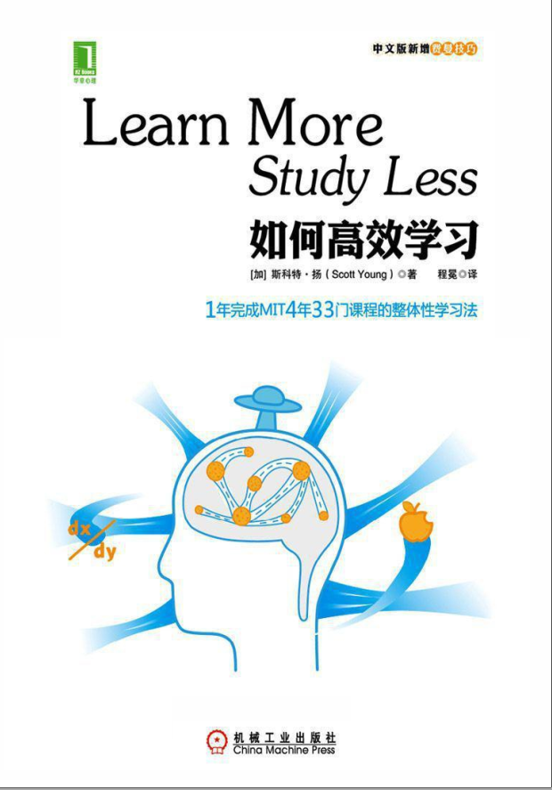

# 如何高效学习

## 整体性学习
如果只用一种方式了解某样事物， 你就不会真正了解它。 了解事物真正含义的秘密取决于如何将其与我们所了解的其他事物相联系。 通过联系， 你可将想法内化于心， 从各种角度看问题， 直至找到适合自己的方法。 这才是思考的真谛！

简单地说， 整体性学习就是看待知识的角度是多方面的。 任何一门知识都不会单独存在， 它总是与方方面面的知识联系在一起。

整体性学习则要尽可能地避免死记硬背

## 整体学习的顺序
·获取阶段的测试──我以前看过或听过这个知识吗？

·理解阶段的测试──我理解知识的含义吗？ （至少是字面上的意思。 ）

·拓展阶段的测试──我知道知识从何而来， 与哪些知识有关系吗？

·纠错阶段的测试──我删除了那些不恰当的联系吗？ 我删除了那些错误结论吗？

·应用阶段的测试──我将知识用到实际生活中了吗？

## 遇到乏味的学科
下一次当碰到“乏味”的课程时， 不要马上抱怨。 问题可能在于老师教你时没有和你的经验联系， 而使用整体性学习方法， 你可以将内容与你感兴趣的东西相连。

## 练习阅读法
快速阅读的另一个办法是练习阅读， 练习阅读与一般的阅读是不一样的。 当你练习阅读时， 你的目的并不是吸收阅读的内容， 练习阅读的唯一目的是训练自己以尽可能快的速度理解所读内容。

（1） 你可以通过阅读一本从未读过的书来练习阅读， 在书上做一个标记， 设定3分钟， 然后用指读法从标记开始， 以稍快于自己能读懂内容的速度进行阅读， 3分钟一到，停止阅读， 再做一个标记。

（2） 算算自己读了几行， 再乘以每行平均单词数（第一段总单词除以第一段行数） ， 得到自己刚才3分钟的总阅读单词数； 再除以3分钟， 得到大约每分钟的阅读单词量。

（3） 这个练习能测试你提高阅读速度的空间有多大。

## 一次学会
一直信奉“一次学会”的学习原则， “一次学会”表示你在学习时要全神贯注地听老师讲课， 而不是忙着做细致漂亮的笔记， 等到课下再学。

## 笔记流
一旦你写下了一个观点， 下一步就是在这个观点和其他观点之间画上一些箭头， 观点不是建立成金字塔式的结构， 而是呈现出相互关联的关系， 这个过程与实际的整体性学习策略类似， 观点连在一张网中。

## 费曼技巧的具体措施：
（1） 理解那些你没有真正掌握的知识点。

（2） 记住那些你能理解， 却可能在考试中遗忘的知识点。

（3） 作为一个考前学习的高效率方法。 很多学生花了不少时间在图书馆度过， 学习效果却平平， 运用费曼技巧， 你只需花上20分钟就能深入理解知识点， 而且记忆深刻， 难以遗忘。

### 第一步： 选择要学习的概念
首先选好你打算深入理解的概念， 拿一张空白纸， 在最上方写下概念的名称。
### 第二步： 设想你是老师， 正在试图教会一名新生这个知识点
这一步你要假想自己费尽口舌让一名毫无这方面知识的学生听懂， 并把你的解释记录下来。 这一步至关重要， 因为在自我解释那些你理解或不理解的知识过程中， 你会理解得更好， 而原先不明白的地方也得以理清。
###　第三步： 当你感到疑惑时， 返回去吧
每当你碰到难题感到疑惑时， 别急着往下走， 学习不是单行道， 回过头来， 重新阅读参考材料、 听讲座或找老师解答， 直到你觉得搞懂了为止， 然后把解释记到纸上。
### 第四步： 简单化和比喻
如果你的解释很啰唆或者艰涩， 尽量用简单直白的语言重新表述它， 或者找到一个恰当的比喻以更好地理解它。

## 增加能量储备
能量并非天生的， 有很多办法可以帮助我们提高能量值， 按照下面的去做吧：

（1） 每周有3～5次运动吗？ 如果你的回答为否， 你正在削弱你的潜在能量水平， 除非你的医生不让你参加运动， 否则最少每天要抽出40分钟来锻炼身体， 每天运动一点点，学习效果更明显。

（2） 每晚有七八个小时的睡眠吗？ 有些人睡四五个小时就够了， 学习工作劲头十足， 不过我想你我又不是这种神人， 那么还是老老实实睡到自然醒吧， 别想着玩游戏、 喝酒、 跳舞、 玩通宵， 熬夜对学习来说有百害而无一利， 我看一年中除了过年可以守岁， 平时绝不要熬夜。 睡得好， 脑袋才清醒。

（3） 你吃的是什么？ 你的食谱是高糖、 高脂肪、 高蛋白质的吗？ 请放弃它吧， 我建议你吃粗纤维和粗加工的食物， 这样的食物可以让你一天的血糖水平保持平稳， 避免忽高忽低。

（4） 一天之内， 你喝几杯水？ 你知道吗？ 你的身体有2/3都是水分， 最快让你丧失能量的办法就是脱水。

（5） 一天你吃几餐？ 如果你的回答是中餐、 晚餐以及时不时吃点早餐， 那么你的能量有可能不足。 理想的饮食应该是少吃多餐， 一天吃四五餐， 每次吃七分饱， 这样可以保证你一天内的营养供应持续稳定， 睡前吃一点能让你第二天早上精力充沛

## 循环式作息计划
线性的计划是平均安排时间执行工作， 而循环式作息计划则先集中小部分时间做大部分工作。 这种计划安排能让你做到有张有弛， 而不是死气沉沉， 像个机器人。 下面是一些建议。

（ 1） 一周休息一天。 我总是抽出一周中的一天， 什么事也不做， 将7天的活放在6天里完成， 一开始很难， 但是放松一天能防止你筋疲力尽。

（ 2） 晚上不干活儿。 将一天的工作放在早上集中完成， 早早完成工作， 晚上你就有几小时的空闲了。

（ 3） 设定90分钟。 给定自己90分钟， 集中精力完成某个学习任务， 一旦90分钟结束， 停止工作。 90分钟的时间设定能让你学习时注意力更集中

## 批处理
批处理的意思就是将那些类似的、 散在的工作集中起来一次做完。 批处理有助于节省时间， 因为你可以集中时间和精力

## 减少挫折障碍的小技巧。
（1） 写下任何障碍。 假如我遇到编程中某个目前无法解决的问题， 我会尽量详细地记下问题， 详细地记下障碍让我们对问题的思考更容易。

（2） 使用网络。 网络就像无所不知的智者和收藏丰富的图书馆。 如果你想不明白某个问题， 或者正在苦苦地翻书寻找答案， 网络可以助你一臂之力。 谷歌、 读秀、 中国知网（CNKI） 都是不错的选择。

（3） 找一本关于“怎么做”的工具书。 有一种书不谈理论， 专门告诉你“怎么做”， 这对于你打算做什么事情来说是非常有价值的。

（4） 换一个角度试试。 如果理解时碰到一个障碍， 试试从一个不同的角度来看问题。 花点时间学习其他相关知识， 等你学会了很多以后， 再回过头看看原来的问题。

